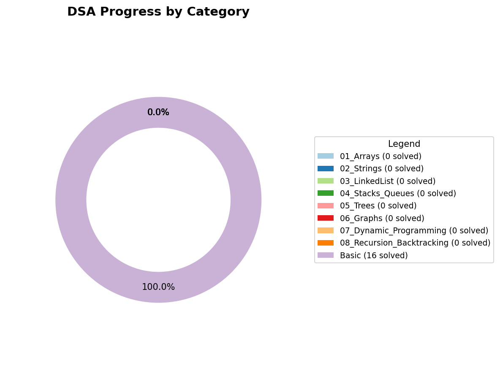

# 🧠 DSA Practice

Welcome to my **Data Structures & Algorithms Practice Repository**!  
This repo contains my daily solutions and progress while solving questions from **Striver’s A2Z Sheet**, **SDE Sheet**, **Striver 79**, and **Blind 75**, primarily on **LeetCode** and **GeeksforGeeks**.

---

## 🚀 My Goal
- ✅ Solve **3 problems every day**
- 🧩 Master all major DSA topics
- 🔁 Build long-term consistency and problem-solving skills
- 💻 Cover 4 major sheets (A2Z, SDE, Striver 79, Blind 75)

---

## 📊 Progress Summary

### 📁 Category-wise Breakdown
| Category | Sub-Category | Questions Solved |
|-----------|---------------|------------------|
| 01_Arrays | easy | 0 |
| 01_Arrays | hard | 0 |
| 01_Arrays | medium | 0 |
| 02_Strings | easy | 0 |
| 02_Strings | hard | 0 |
| 02_Strings | medium | 0 |
| 03_LinkedList | easy | 0 |
| 03_LinkedList | hard | 0 |
| 03_LinkedList | medium | 0 |
| 04_Stacks_Queues | easy | 0 |
| 04_Stacks_Queues | hard | 0 |
| 04_Stacks_Queues | medium | 0 |
| 05_Trees | easy | 0 |
| 05_Trees | hard | 0 |
| 05_Trees | medium | 0 |
| 06_Graphs | easy | 0 |
| 06_Graphs | hard | 0 |
| 06_Graphs | medium | 0 |
| 07_Dynamic_Programming | easy | 0 |
| 07_Dynamic_Programming | hard | 0 |
| 07_Dynamic_Programming | medium | 0 |
| 08_Recursion_Backtracking | easy | 0 |
| 08_Recursion_Backtracking | hard | 0 |
| 08_Recursion_Backtracking | medium | 0 |
| Basic | Patterns | 14 |

### 📈 Visual Progress

-
 
🟩
 
*
*
0
1
_
A
r
r
a
y
s
*
*
 
—
 
0
 
q
u
e
s
t
i
o
n
s

-
 
🟦
 
*
*
0
2
_
S
t
r
i
n
g
s
*
*
 
—
 
0
 
q
u
e
s
t
i
o
n
s

-
 
🟥
 
*
*
0
3
_
L
i
n
k
e
d
L
i
s
t
*
*
 
—
 
0
 
q
u
e
s
t
i
o
n
s

-
 
🟨
 
*
*
0
4
_
S
t
a
c
k
s
_
Q
u
e
u
e
s
*
*
 
—
 
0
 
q
u
e
s
t
i
o
n
s

-
 
🟪
 
*
*
0
5
_
T
r
e
e
s
*
*
 
—
 
0
 
q
u
e
s
t
i
o
n
s

-
 
🟧
 
*
*
0
6
_
G
r
a
p
h
s
*
*
 
—
 
0
 
q
u
e
s
t
i
o
n
s

-
 
🟩
 
*
*
0
7
_
D
y
n
a
m
i
c
_
P
r
o
g
r
a
m
m
i
n
g
*
*
 
—
 
0
 
q
u
e
s
t
i
o
n
s

-
 
🟦
 
*
*
0
8
_
R
e
c
u
r
s
i
o
n
_
B
a
c
k
t
r
a
c
k
i
n
g
*
*
 
—
 
0
 
q
u
e
s
t
i
o
n
s

-
 
🟥
 
*
*
B
a
s
i
c
*
*
 
—
 
1
4
 
q
u
e
s
t
i
o
n
s

🕒 **Last Updated:** 13 November 2025, 12:21 AM

---

## 📂 Folder Structure

<pre><code>
DSA-Practice/
│
├── 01_Arrays/
│   ├── easy/
│   ├── medium/
│   └── hard/
│
├── 02_Strings/
├── 03_LinkedList/
├── 04_Stacks_Queues/
├── 05_Trees/
├── 06_Graphs/
├── 07_Dynamic_Programming/
├── 08_Recursion_Backtracking/
├── Basic/
└── README.md
</code></pre>

---

## 🧰 Tech Stack

---

## 🧩 Platforms I'm Practicing On

---

## 🚀 GitHub & LeetCode Stats

### 🧮 GitHub Stats

### 🔥 Streak Tracker

### 🧩 LeetCode Stats

---

## ⏱️ Repo Activity

---

## 📬 Connect with Me

---